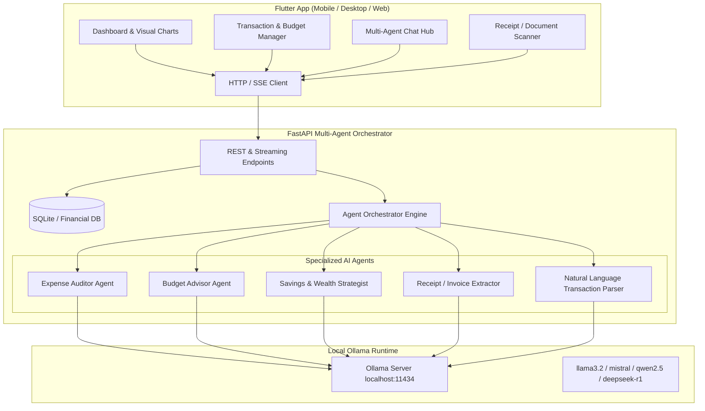

# FinTrack: Local AI Multi-Agent Financial Assistant

## Architecture Overview

---

## Key Modules to Implement

1. **Python FastAPI Backend (`backend/`)**:
   - `main.py`: Core server with endpoints for transactions, budgets, multi-agent consultation, receipt parsing, and health checks.
   - `agents/`: Dedicated prompt workflows and structured function-calling for:
     - **Expense Auditor**: Detects spending anomalies, subscription creeps, and category distribution.
     - **Budget Advisor**: Computes 50/30/20 budget splits, category caps, and month-to-date trajectory.
     - **Savings Strategist**: Sets targets, emergency fund calculations, and milestone forecasts.
     - **Receipt Parser & NLP Agent**: Converts raw text/receipts to typed JSON transactions.
   - `database.py`: SQLite persistence for transactions, budgets, goals, and agent conversation histories.
   - `ollama_client.py`: Robust connector to Ollama with streaming support and model management.

2. **Flutter Application (`frontend/`)**:
   - **Modern Aesthetic**: Dark/Glassmorphic sleek UI with vibrant financial accents (Emerald, Indigo, Violet, Amber).
   - **Dashboard**: Monthly burn rate, category breakdowns (Pie/Donut charts), dynamic income vs. expense graphs, budget health meter.
   - **Transactions Manager**: Quick search, filters, manual + AI Natural Language input modal.
   - **AI Multi-Agent Consultation Room**: Interactive chat with role selector (Auditor, Advisor, Strategist) with real-time streaming and agent rationale tags.
   - **Receipt & Document Analyzer**: Paste or upload receipt details to have the AI auto-extract merchant, total, date, and category.
   - **Settings**: Ollama model selector, endpoint configuration (`localhost:11434`), and mock/live toggle.
