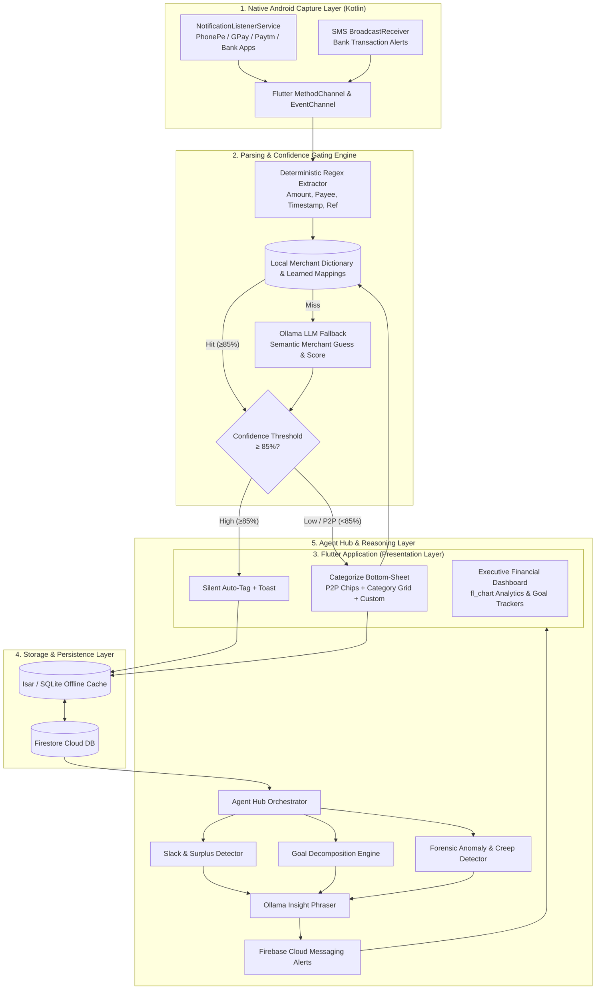
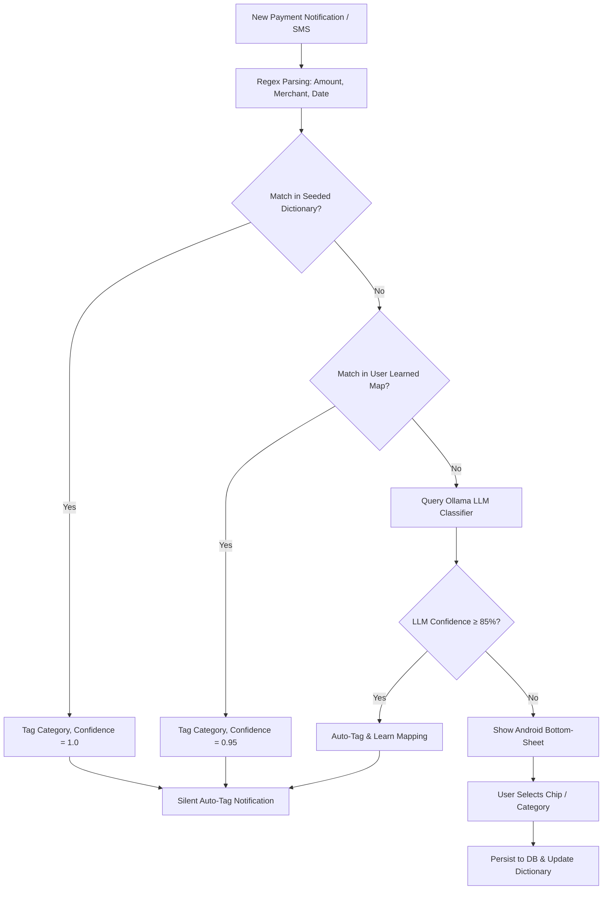

# FinTrack: Product & Technical Specification

> **Flutter / Android · Firebase / SQLite · Hosted & Local Ollama**  
> Proactive AI Financial Agent for Automated UPI/SMS Expense Capture, Intelligent Categorization & Goal-Driven Dynamic Budgeting.

---

## 1. Product Overview

FinTrack is an offline-first Android application built with **Flutter** that automatically detects and categorizes daily expenses from payment app notifications (**PhonePe, Google Pay, Paytm**) and bank SMS messages. It tracks spending against user-defined monthly budgets and operates as an **autonomous proactive agent**—flagging unusual spend, forecasting budget overruns, and dynamically reallocating budget categories to help users hit longer-term savings goals without tedious manual bookkeeping.

### 1.1 Core Capabilities
- **Zero-Friction Transaction Capture**: Native Android `NotificationListenerService` and SMS broadcast listeners detect financial transactions in real time from PhonePe, Google Pay, Paytm, CRED, and major Indian banks (HDFC, SBI, ICICI, Axis, Kotak).
- **Confidence-Gated Categorization**: Known merchants and learned patterns are auto-tagged silently with an undo snackbar; only ambiguous or P2P transfers prompt the user with a native bottom-sheet.
- **Monthly Budget Allocation & Real-Time Burn Rate**: Category-level budgets with live velocity tracking and overrun warnings.
- **Autonomous Agent Insights**: Anomaly detection, subscription creep alerts, and end-of-month spend forecasting.
- **Goal-Driven Dynamic Budget Allocation**: Sets targets (e.g. ₹60,000 laptop in 6 months), decomposes into monthly/weekly targets, identifies category "slack", and proposes weekly budget reallocations.
- **Deterministic Math + LLM Phrasing**: All financial math, limits, and reallocations are computed deterministically; LLMs (Ollama) are utilized strictly for semantic parsing, unknown merchant tagging, and natural-language insight phrasing.
- **Human-in-the-Loop Safety Gate**: The agent proposes budget reallocations; the user confirms with a single tap. Virtual reallocations only (no movement of real banking funds).

---

## 2. System Architecture

---

## 3. Agent-Hub Pattern & Component Mapping

| Block | Component Mapping | Responsibility |
| :--- | :--- | :--- |
| **Agent Hub** | Backend Orchestrator (FastAPI / Cloud Functions) | Coordinates scheduled tasks, triggers reasoning loops, manages event pipelines. |
| **Tool API** | Ollama endpoint, Budget Math Calculator, FCM Notifier | Swappable API connectors for LLMs, deterministic math engines, and push notifications. |
| **Memory State** | Firestore + Local Isar / SQLite Cache | Retains 3+ months of categorized spend, user correction history, budget velocity, and goal milestones. |
| **Decision Logic** | Rule matchers, Slack detection, Goal reallocator | Deterministic algorithms for spending limits and cash flow; LLM reserved for NLP and insight formatting. |
| **Confirmation Gate** | Flutter UI Reallocation Card / Dialog | Requires explicit user 1-tap confirmation before altering in-app budget limits. |

---

## 4. Confidence-Gated Categorization Pipeline

### 4.1 Auto-Categorize (Silent Flow)
1. **Pre-seeded Dictionary**: Matches common merchants across Food (Swiggy, Zomato, Starbucks), Groceries (Blinkit, Zepto, DMart), Transit (Uber, Ola, Shell), OTT (Netflix, Spotify), Utilities (BESCOM, Airtel).
2. **Learned Memory**: Any payee previously categorized by the user.
3. **High-Confidence LLM**: LLM semantic score $\ge 0.85$.

### 4.2 User Confirmation (Bottom-Sheet Flow)
- Triggered for P2P UPI transfers (personal mobile numbers / names), uncataloged local stores, or low LLM confidence.
- Native Android bottom-sheet UI featuring:
  - **Transaction Summary**: Amount, Payee Name / VPA, App Source, Timestamp.
  - **Quick P2P Reason Chips**: `Personal`, `Friend`, `Rent`, `Gift`, `Split`, `Other`.
  - **Standard Category Grid**: `Food & Dining`, `Shopping`, `Transportation`, `Bills & Utilities`, `Entertainment`, `Health`.
  - **Free-Text Custom Label**: If used $\ge 3$ times, agent suggests promoting it to a permanent category.

---

## 5. Goal-Driven Dynamic Budget Allocation

### 5.1 Mathematical Decomposition
For a savings target $G$ with target completion in $M$ months:
$$\text{Baseline Monthly Target} = \frac{G}{M}$$

Adjusted targets are weighted for seasonal spikes (e.g. festive months, insurance renewals) vs. quiet periods.

### 5.2 Weekly Re-planning & Slack Detection
1. **Slack Identification**: Identifies discretionary categories consistently under budget:
   $$\text{Slack}_i = \text{Budget}_i \times \frac{\text{DayOfMonth}}{\text{DaysInMonth}} - \text{Spent}_i$$
2. **Surplus Shifting**: Shifts identified positive slack toward the goal envelope first, shielding essential categories (Rent, Groceries, Utilities).
3. **LLM Natural Language Synthesis**: Converts raw numeric shifts into human advice:
   > *"You have ₹1,200 unused slack in Entertainment this week. Shifting ₹800 into your **Laptop Goal** keeps you 12 days ahead of schedule without impacting your weekend budget."*

---

## 6. Schema & Data Models

### 6.1 Firestore / SQLite Collections
- `transactions`: `id`, `amount`, `merchant`, `rawText`, `category`, `source` (`p2p` | `merchant`), `confidence`, `timestamp`, `status` (`auto` | `confirmed` | `skipped`)
- `budgets`: `month` (`YYYY-MM`), `category`, `allocatedAmount`, `spentAmount`
- `merchant_dictionary`: `merchantKey`, `category`, `learnedFromUser` (`bool`), `lastUpdated`
- `goals`: `goalId`, `title`, `targetAmount`, `targetDate`, `currentProgress`, `status` (`active` | `achieved` | `at_risk`)
- `goal_monthly_plan`: `planId`, `goalId`, `month`, `targetSavings`, `actualSavings`, `categoryAdjustments`

---

## 7. Build Milestones

| Stage | Milestone | Deliverables |
| :--- | :--- | :--- |
| **M1** | Core Shell & Local DB | Flutter UI, manual entry, Isar/SQLite storage, budget cards. |
| **M2** | Native Android Capture | Kotlin `NotificationListenerService` + SMS receiver via MethodChannel. |
| **M3** | Confidence Gating & Popup | Pre-seeded dictionary, learned lookup, compact bottom-sheet UX. |
| **M4** | Ollama LLM Classifier | Semantic merchant classification fallback with confidence scoring. |
| **M5** | Agent Hub & Proactive Insights | Weekly re-planning, slack detection, anomaly alerts, budget forecasting. |
| **M6** | Dynamic Goal Allocation | Goal decomposition engine, surplus reallocator with 1-tap confirmation. |
