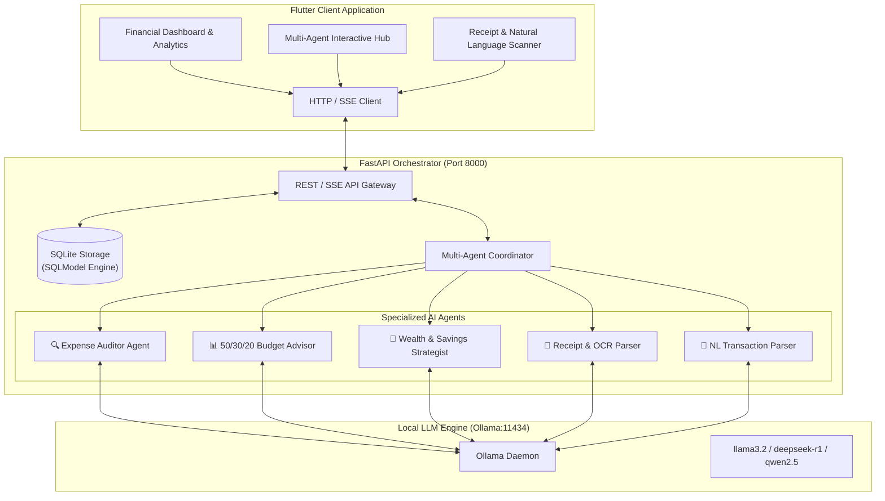

<div align="center">

# ⚡ FinTrack — Local AI Multi-Agent Financial Assistant

[](https://www.python.org/)
[](https://fastapi.tiangolo.com)
[](https://ollama.com/)
[](https://flutter.dev/)
[](https://sqlmodel.tiangolo.com/)
[](LICENSE)

<p align="center">
  <b>A private, offline-first personal financial management ecosystem powered by local multi-agent LLMs via Ollama.</b><br>
  Analyze spending velocity, enforce 50/30/20 budgets, scan receipts, and execute automated forensic audits—all on your own machine.
</p>

[Key Features](#-key-features) •
[Architecture](#-system-architecture) •
[Agent Council](#-specialized-agent-council) •
[API Reference](#-api-endpoints) •
[Getting Started](#-getting-started) •
[Roadmap](#-roadmap)

</div>

---

## 🌟 Key Features

- 🔒 **100% Privacy & Local Compute**: Zero financial data ever leaves your device. All LLM inferences are handled locally through **Ollama** (`llama3.2`, `deepseek-r1`, `mistral`, or `qwen2.5`).
- 🤖 **Autonomous Multi-Agent Council**:
  - **Forensic Expense Auditor**: Automatically scans ledger entries for subscription creep, recurring leakages, and discretionary spending spikes.
  - **50/30/20 Budget Advisor**: Classifies transactions into Needs, Wants, and Savings targets with dynamic burn-rate velocity calculations.
  - **Wealth & Savings Strategist**: Simulates compound growth forecasts and tracks milestone timelines for emergency funds and custom goals.
  - **Natural Language & Receipt Parser**: Converts unstructured text (`"Paid $45 for dinner at Olive Garden"`) or raw receipt OCR into typed, structured transactions.
- ⚡ **High-Performance FastAPI Core**: Async REST and streaming endpoints with SQLModel/SQLite database persistence.
- 📱 **Cross-Platform Flutter Frontend**: Responsive interface supporting Web, Desktop (macOS/Windows/Linux), and Mobile (iOS/Android).

---

## 📐 System Architecture



---

## 👥 Specialized Agent Council

| Agent | Role & Responsibility | Output / Capability |
| :--- | :--- | :--- |
| **🔍 Expense Auditor** | Forensic transaction inspection, anomaly detection, subscription tracking | Actionable risk flags, spending velocity diagnostics |
| **📊 Budget Advisor** | 50/30/20 rule enforcement, category limit compliance | Real-time burn rate, remaining daily allowance |
| **💎 Savings Strategist** | Net cash flow optimization, compound milestone forecasting | Target completion dates, allocation rebalancing |
| **🧾 Receipt Extractor** | Zero-shot receipt/invoice JSON structuring | Merchant, tax, items, and total extraction |
| **💬 NL Parser** | Informal human text to normalized database transaction | Conversational expense logging |

---

## 🚀 Getting Started

### Prerequisites
- **Python**: `3.10+`
- **Flutter SDK**: `3.0+`
- **Ollama**: Installed and running locally ([Download Ollama](https://ollama.com))

```bash
# Pull your preferred local model
ollama pull llama3.2
```

---

### 1. Backend Setup

```bash
# Navigate to backend directory
cd backend

# Create and activate virtual environment
python -m venv venv
# On Windows:
.\venv\Scripts\activate
# On Linux/macOS:
source venv/bin/activate

# Install dependencies
pip install -r requirements.txt

# Start FastAPI server
uvicorn main:app --host 0.0.0.0 --port 8000 --reload
```

The API will initialize SQLite with seed data and be accessible at:
- **API URL**: `http://localhost:8000`
- **Interactive Swagger Docs**: `http://localhost:8000/docs`

---

### 2. Frontend Setup

```bash
# Navigate to frontend directory
cd frontend

# Get Flutter dependencies
flutter pub get

# Run on Chrome / Desktop / Connected Mobile Device
flutter run -d chrome
```

---

## 📡 API Endpoints

### 🩺 Health & Diagnostics
| Method | Endpoint | Description |
| :--- | :--- | :--- |
| `GET` | `/api/health` | Check backend health and Ollama connection status |
| `GET` | `/api/models` | List all local Ollama models installed |

### 💳 Ledger & Budgets
| Method | Endpoint | Description |
| :--- | :--- | :--- |
| `GET` | `/api/transactions` | Retrieve all transactions sorted by date |
| `POST` | `/api/transactions` | Create a new transaction |
| `DELETE` | `/api/transactions/{id}` | Delete a transaction by ID |
| `GET` | `/api/budgets` | Get all category budgets and utilization |
| `POST` | `/api/budgets` | Create or update budget category limit |
| `GET` | `/api/goals` | List all savings and emergency fund goals |
| `POST` | `/api/goals` | Create a new savings milestone |
| `GET` | `/api/analytics` | Compute 50/30/20 breakdown, cash flow, and savings rate |

### 🧠 Multi-Agent AI Endpoints
| Method | Endpoint | Description |
| :--- | :--- | :--- |
| `POST` | `/api/agent/chat` | Interactive chat with Auditor, Advisor, or Strategist |
| `POST` | `/api/agent/audit` | Trigger parallel multi-agent council forensic audit |
| `POST` | `/api/agent/parse-expense` | Parse natural language sentence into structured JSON |
| `POST` | `/api/receipt/parse` | Extract structured merchant/total data from raw text/OCR |

---

## 📂 Project Structure

```text
FinTrack/
├── backend/
│   ├── agents.py           # Multi-agent council definitions & prompts
│   ├── database.py         # SQLModel database schemas & seed data
│   ├── main.py             # FastAPI routing, middleware & controllers
│   ├── ollama_service.py   # Async Ollama client with fallback simulation
│   └── requirements.txt    # Python package dependencies
├── frontend/
│   ├── lib/
│   │   └── main.dart       # Flutter client entrypoint
│   ├── android/            # Android native project files
│   ├── ios/                # iOS native project files
│   ├── web/                # Web entrypoint & manifest
│   └── windows/            # Windows native runner
├── .gitignore              # Environment, build & cache exclusions
├── ARCHITECTURE.md         # Detailed technical architecture specification
└── README.md               # Project documentation & reference
```

---

## 🤝 Contributing

Contributions are welcome! Please follow conventional commit guidelines:

- `feat:` New features or agent capabilities
- `fix:` Bug fixes and corrections
- `docs:` Documentation improvements
- `refactor:` Code restructuring without functional changes
- `chore:` Dependency or build system updates

```bash
# Branch convention: feat/your-feature-name or fix/issue-description
git checkout -b feat/add-agent-streaming
```

---

## 📄 License

Distributed under the **MIT License**. See `LICENSE` for more information.